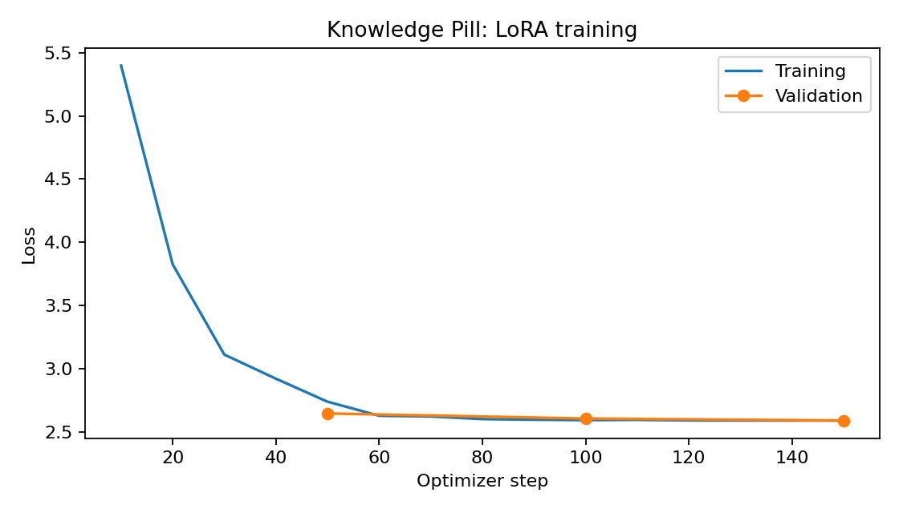
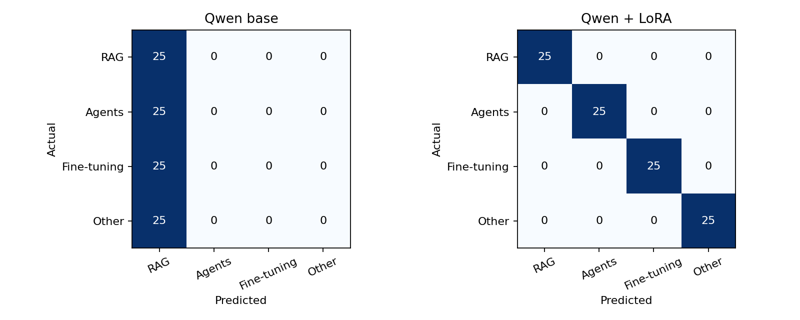
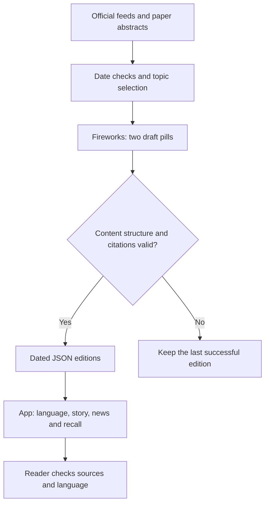

# Knowledge Pill

**Two short AI learning sessions: understand one concept, then catch up on dated AI developments—in English or Telugu.** Built by Rushikeshava for The Gen Academy Week 5.

Developers face more AI articles than they can read. Knowledge Pill narrows that problem to three learning interests—RAG, Agents and Fine-tuning—and turns selected source material into a story, explanation, practice task and recall question. Each pill targets 5–10 minutes including the activity. This is a learning aid, not a proven memory-improvement intervention.

[Open the app](https://knowledge-pill.drkreddy.chatgpt.site) · [Start here](START_HERE.md) · [Demo recording script](docs/DEMO_SCRIPT.md) · [Handout mapping](docs/HANDOUT_MAPPING.md)

The hosted app is currently owner-private. Reviewers can inspect this public repository, run the static app locally, and watch the Loom once its link is added. There is no Loom recording linked yet.

## What is complete

- Qwen3-1.7B-Base baseline, LoRA training, merged-model inference, five smoke tests and evaluation completed in Colab.
- Actual exported predictions, dataset hashes and metrics verified; reports, logs and figures are committed in [results/run_2026-09-12](results/run_2026-09-12).
- A real browser classifier, source-linked foundation lessons, daily knowledge/news views, English/Telugu selection, recall practice and device-local history.
- Fireworks generation code, a manual Colab notebook and a daily GitHub Actions workflow. Saved editions load automatically from this repository.
- First real English and Telugu generation verified in [workflow attempt 3](https://github.com/DRKREDDY5/Knowledge-Pill/actions/runs/34724909759/attempts/3). Both languages produced a knowledge pill and a news pill, passed validation and were saved automatically.
- Dated English/Telugu demonstration editions with explicit provenance. These were authored for the demo and are **not evidence of a successful Fireworks run**.

**Remaining:** review the generated drafts and Telugu wording, then enable the schedule with `DAILY_PILLS_ENABLED=true` if it is not already set. A manual run is verified; a scheduled run has not been verified. An executed training notebook, adapter download confirmation and the Loom recording remain outstanding. See [setup](docs/DAILY_SETUP.md), [content review](docs/CONTENT_REVIEW.md) and [status](docs/BUILD_STATUS.json). The repository notebook is reproducible source, not a reconstructed executed notebook.

## Week 5: one small classification decision

The handout routes a support ticket to a resolver queue. Our custom task routes an **English article title and short description → RAG / Agents / Fine-tuning / Other**. The model does not write the lesson as part of its fine-tuning task.

| Handout component | Our implementation |
|---|---|
| Labelled CSV | [data/knowledge_pill.csv](data/knowledge_pill.csv): 500 rows with original split assignments |
| Source data | [topic_seeds.json](data/topic_seeds.json): 100 authored scenarios × five formatting variations |
| 80/20 split | 400 train / 100 validation, balanced by label; scenario variations stay together |
| ShareGPT and registration | Generated by notebook step 3; actual snapshot is in the results directory |
| Qwen3-1.7B-Base + LoRA | Rank 8, three epochs, 512-token limit; LLaMA Factory CLI |
| Loss plot, merge, classify(), smoke tests | Notebook steps 8–9; five tests passed |
| Before/after metrics | Notebook step 10; reports and confusion matrices saved |
| Custom submission | This GitHub repository plus your Loom link |

We used LLaMA Factory’s command line, which uses the same training engine as the LLaMA Board UI demonstrated in the handout. No Board UI run is claimed.

## Actual results

| Model | Validation accuracy (100) | Validation macro F1 | Paper accuracy (16) | Paper macro F1 |
|---|---:|---:|---:|---:|
| TF-IDF + logistic regression | 100% | 1.000 | 93.75% (15/16) | 0.9365 |
| Qwen before training | 25% | 0.100 | 25% (4/16) | 0.1000 |
| Qwen + LoRA, merged | 100% | 1.000 | 87.5% (14/16) | 0.8667 |

Fine-tuning improved Qwen on this task. It did not beat the simple classifier on the paper examples, so the browser and daily source selector use the simpler model. That avoids a GPU requirement for ordinary reading. A 16-case difference does not establish broad model superiority; latency/cost superiority was not benchmarked end to end.

The fine-tuned router misclassified the CLIP and Whisper summaries as Fine-tuning instead of Other. The simple classifier missed SWE-agent. Validation comprises **20 scenario groups**, not 100 independent collected articles, and also selected the best checkpoint. The 16 paper labels were authored for this project and are not independently reviewed. Read the [evaluation report](docs/EVALUATION.md).





## Product architecture



A fixed workflow fits the task: collect, select, write, check and save. Multiple autonomous agents would add complexity without a clear need. The trained Qwen router remains an evaluated course artifact. A separate existing Fireworks model writes the daily content; it is not our fine-tuned Qwen model.

The default schedule generates **RAG in English and Telugu: two requests per day**, each producing a knowledge pill and a news pill. Change [configs/daily.json](configs/daily.json) to choose other supported topics. Three topics in both languages would make six requests. The app does not provision individual cloud schedules per reader.

News dates use the configured timezone. Future-dated entries are excluded; older material is labelled recent and limited to seven days. There are at most three selected updates. If no eligible updates are available, the edition says so. Feed failures are recorded. This is bounded source collection, not exhaustive research or independent fact verification.

## Run it

**Course experiment:** open [Knowledge_Pill_Simple.ipynb](notebooks/Knowledge_Pill_Simple.ipynb) in Google Colab with a CUDA GPU. Data and helper code are embedded. Existing completed runs do not need retraining.

**Daily generation:** follow [DAILY_SETUP.md](docs/DAILY_SETUP.md), or open [Knowledge_Pill_Daily.ipynb](notebooks/Knowledge_Pill_Daily.ipynb) in CPU Colab. Keep keys in Secrets, never code. No key is required to read the dated demonstrations.

**Local app:** from the repository root run `python -m http.server 8000 --directory dist`, then open `http://localhost:8000`. All pages are static. Preferences and review progress are device-local, not cloud accounts.

**Checks:**

```bash
python -m pip install -r requirements-data.txt
python -m unittest discover -s tests -v
node --check dist/app.js
node --check dist/daily-view.mjs
```

## Repository guide

| Location | Purpose |
|---|---|
| `notebooks/` | Reproducible training notebook and manual daily writer |
| `data/knowledge_pill.csv` | Spreadsheet-readable labelled examples; split column preserves the actual run |
| `data/topic_seeds.json`, `data/source_cases.json` | Authored source scenarios and 16 paper diagnostics |
| `router.py`, `configs/train.yaml`, `configs/merge.yaml` | Data preparation, model inference and training configuration |
| `results/run_2026-09-12/` | Verified original Colab export, including exact run configurations and data snapshot |
| `daily_pills.py`, `scripts/run_daily.py` | Source collection, Fireworks writing, validation and bounded edition saving |
| `.github/workflows/` | Project checks and configurable daily generation |
| `editions/latest.json` | Latest saved drafts read by the app; initially labelled demonstrations |
| `examples/`, `docs/CONTENT_REVIEW.md` | Demonstration content and editorial review record |
| `dist/` | Static app and downloadable project bundle |
| `docs/` | Architecture, evaluation, setup, handout mapping and Loom script |

## Submission

Custom projects use GitHub + Loom under the supplied handout. Deadline: **September 13, 2026, 11:59 PM Pacific**. [Submission form](https://forms.gle/7Hpa2Pkd8ZaWUomm6).

Add the executed training notebook and Loom link before submitting. Keep the adapter ZIP safe; do not commit multi-gigabyte model weights or credentials. A readable repository and an honest demo matter more than extra features.
